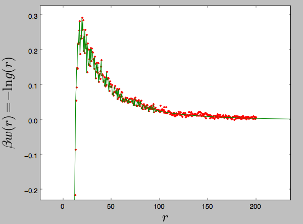

# virial.py
Script to fit the tail of radial distribution functions to arbitrary model potentials and to calculate
the resulting virial coefficient and/or Kirkwood-Buff integrals (todo).

## Usage

All options can be viewed from the command line by typing `virial.py -h`:

~~~~
usage: virial.py [-h] [-z z1 z2] [-a a1 a2] [-mw mw1 mw2] [-lB lB] [-p] [-so]
                 [--norm {none,2d,3d}] [-r min max] [--pot POT]
                 [--guess GUESS [GUESS ...]] [--potlist]
                 infile outfile

Fit tail of RDFs to model pair potentials

positional arguments:
  infile                two column input file with radial distribution
                        function, g(r)
  outfile               three column output with manipulated r, w(r), g(r)

optional arguments:
  -h, --help            show this help message and exit
  -z z1 z2              valencies (default: [0, 0])
  -a a1 a2, --radii a1 a2
                        radii [angstrom] (default: [0, 0])
  -mw mw1 mw2           mol. weights [g/mol] (default: [0, 0])
  -lB lB, --bjerrum lB  Bjerrum length [angstrom] (default: 7.1)
  -p, --plot            plot fitted w(r) using matplotlib (default: False)
  -so, --shiftonly      do not replace tail w. model potential (default:
                        False)
  --norm {none,2d,3d}   normalize w. volume element (default: none)
  -r min max, --range min max
                        fitting range [angstrom] (default: [0, 0])
  --pot POT             pair-potential -- either from list or user-defined
                        (default: None)
  --guess GUESS [GUESS ...]
                        initial guess for fitting parameters (default: None)
  --potlist             show built-in potentials and quit (default: False)
~~~~

## Requirements

`numpy`, `scipy`, `matplotlib`.

## Example

In this example we load a raw probability histogram for the distances between two monovalent particles, simulated in 3d, and:

1. normalize by a spherical volume element,
2. fit tail to Yukawa potential via the Debye length (we provide an initial guess of D=30 Å) in 
   the range 100-200 Å,
3. normalize data and replace tail with fitted Yukawa potential,
4. integrate to get the osmotic second virial coefficient,
5. plot the result using `matplotlib`.

~~~~
virial.py gofr.dat wofr.dat --pot dh --guess 30 0 -z 1 1 --range 100 200 --norm 3d --plot
~~~~

The resulting output will look something like this,

~~~~
model potential:
  w(r)/kT = lB * z1 * z2 / r * np.exp(-r/a[0]) + a[1]
        a = [ 96.12826973  -1.33174551]

virial coefficient:
  B2hs =  261.799387799 A3 ( [0, 5.0] )
  B2   =  388203.844125 A3 = NaN mlmol/g2  ( [0, 799.5] )
  B2*  =  1482.82945728
~~~~

## Credits
Should you find this useful, citation of the following explanatory paper is greatly appreciated,

- Li et al., [J. Phys. Chem. B, 2015, 119:503-508](http://dx.doi.org/10.1021/jp512027j).

Thanks!
